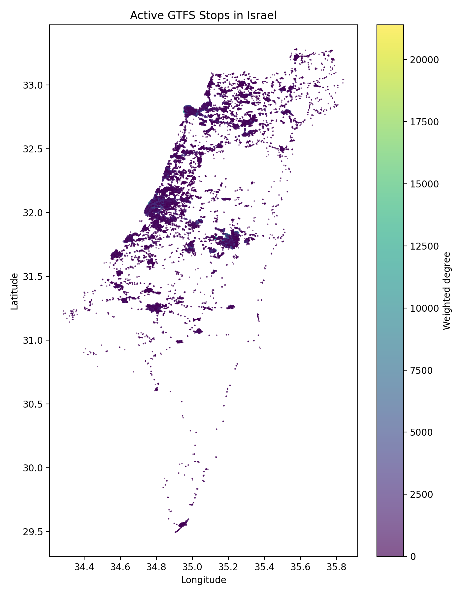
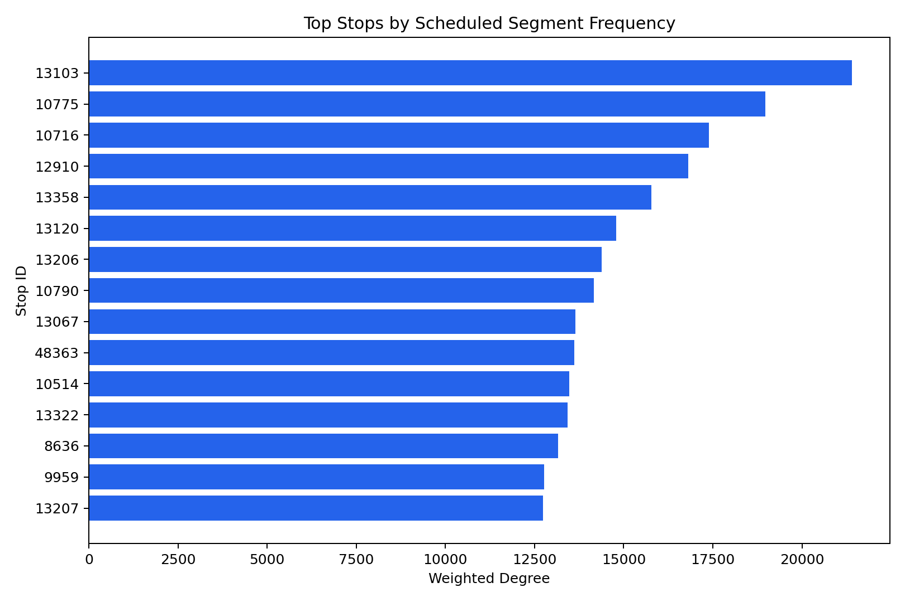
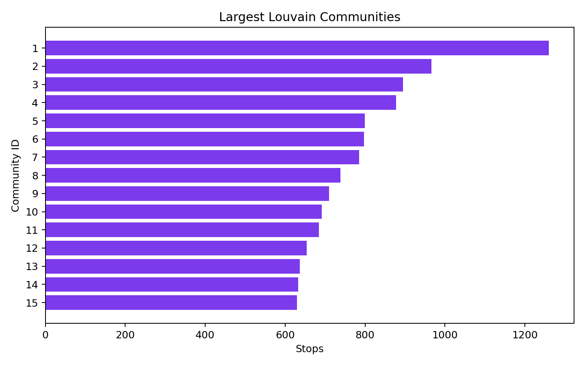
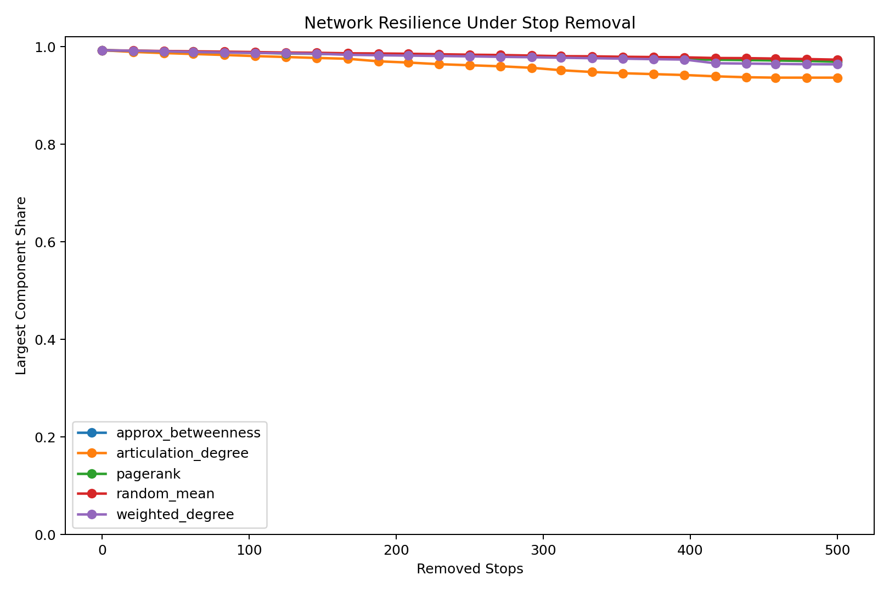

# תחנות קריטיות: ניתוח מרכזיות ועמידות ברשת התחבורה הציבורית בישראל

קורס: אלגוריתמים ברשתות / אלגוריתמים בגרפים  
מרצה: ד"ר אבנר פריאל  
מגישים: סטודנט/ית 1, סטודנט/ית 2, סטודנט/ית 3  
תאריך: מאי 2026

## תקציר

בפרויקט זה ניתחנו את רשת התחבורה הציבורית בישראל כרשת מורכבת. מטרת העבודה היא לזהות תחנות קריטיות ברשת, להבין האם מדדי מרכזיות שונים מצביעים על אותן תחנות, ולהעריך את עמידות הרשת במקרה של השבתת תחנות מרכזיות. מקור הנתונים הוא קובצי GTFS של התחבורה הציבורית בישראל, הכוללים תחנות, קווים, נסיעות, לוחות זמנים, מסלולים ונתוני שירות. בנינו גרף מכוון שבו כל צומת הוא תחנה וכל קשת מייצגת מעבר בין שתי תחנות עוקבות באותה נסיעה. משקל הקשת הוא מספר הפעמים שבהן מקטע זה מופיע בלוח הזמנים.

הגרף שהתקבל כולל 30,466 תחנות פעילות, 51,999 קשתות מכוונות ו-51,772 קשתות לא מכוונות. הרכיב הקשיר הגדול מכיל 30,237 תחנות, כלומר כ-99.25% מהתחנות הפעילות. חישבנו מדדי מרכזיות כגון דרגה, דרגה משוקללת, PageRank, betweenness מקורב, נקודות חיתוך וגשרים. בנוסף, ביצענו חלוקה לקהילות בשיטת Louvain והרצנו סימולציות עמידות שבהן מסירים תחנות לפי אסטרטגיות שונות ומשווים אותן להסרה אקראית.

התוצאות מראות שאין הגדרה אחת בלבד ל"תחנה קריטית". תחנות כמו קניון עזריאלי/דרך מנחם בגין וגשר המיתרים/שד' הרצל בולטות בתדירות שירות גבוהה, בעוד תחנות כמו מחלף חמד, מחלף קמה לצפון ותחנות התרעננות בדרום בולטות במדד betweenness משום שהן מחברות אזורים שונים ברשת. מבחינת עמידות, הסרת 500 תחנות לפי נקודות חיתוך ודרגה פגעה ברכיב הקשיר הגדול יותר מכל אסטרטגיה אחרת שנבדקה, והשאירה אותו בגודל של כ-93.64% מהרשת המקורית, לעומת כ-97.32% בהסרה אקראית ממוצעת. מכאן שהרשת הארצית גדולה ומחוברת היטב, אך עדיין מכילה צווארי בקבוק מקומיים ותחנות שחשיבותן המבנית אינה בהכרח נובעת מכמות השירות בלבד.

## 1. מבוא ומוטיבציה

תחבורה ציבורית היא מערכת תשתית קריטית. פגיעה בתחנה מרכזית, חסימה זמנית, תקלה תפעולית או עומס חריג יכולים להשפיע על אלפי נוסעים ועל קישוריות בין אזורים. ברשת תחבורה גדולה, לא מספיק לדעת אילו תחנות עמוסות; חשוב להבין גם אילו תחנות מחברות בין חלקים שונים של הרשת, אילו תחנות נמצאות על מסלולים רבים, ואילו תחנות גורמות לפיצול של הרשת אם מסירים אותן.

שאלת המחקר המרכזית בפרויקט היא:

**אילו תחנות הן הקריטיות ביותר ברשת התחבורה הציבורית בישראל, וכיצד ניתן למדוד את תרומתן לקישוריות ולעמידות הרשת?**

מתוך שאלה זו נגזרו ארבע שאלות משנה:

1. אילו תחנות הן המרכזיות ביותר לפי מדדי מרכזיות שונים?
2. האם מדדי מרכזיות מבוססי תדירות שירות מזהים את אותן תחנות כמו מדדים מבניים?
3. עד כמה הרשת עמידה להסרה מכוונת של תחנות מרכזיות לעומת הסרה אקראית?
4. האם ניתן לזהות קהילות או תתי-רשתות משמעותיות בתוך רשת התחבורה הארצית?

העבודה מתאימה לנושאי הקורס משום שהיא מיישמת מודל רשת בקנה מידה גדול, משתמשת במדדי centrality, רכיבי קשירות, נקודות חיתוך, גשרים, חלוקה לקהילות וסימולציות עמידות. בנוסף, הפרויקט מדגים את הפער בין מדד תפעולי פשוט, כמו כמות נסיעות, לבין חשיבות מבנית במונחי תורת הגרפים.

## 2. עבודה קשורה

הבסיס התאורטי של הפרויקט נשען על ניתוח רשתות מורכבות. Newman מתאר מדדים מבניים כגון דרגה, קשירות, קהילות ומדדי מרכזיות ככלים להבנת מערכות גדולות, כולל מערכות תחבורה ותשתית. Easley ו-Kleinberg מציגים רשתות כשפה כללית לתיאור מערכות מקושרות ולניתוח השפעה, זרימה ומבנה.

מדד betweenness centrality מבוסס על הרעיון שצומת חשוב אם הוא נמצא על הרבה מסלולים קצרים בין זוגות צמתים. NetworkX מתאר את המדד כסכום חלקם של המסלולים הקצרים העוברים דרך צומת נתון, והיישום המקובל מבוסס על האלגוריתם של Brandes משנת 2001. מכיוון שהגרף בפרויקט כולל מעל 30 אלף תחנות, חישוב exact betweenness לכל הזוגות יקר, ולכן השתמשנו בגרסה מקורבת באמצעות דגימת 128 צמתי מקור.

PageRank פותח במקור לדירוג דפי Web, אך מתאים גם לגרפים מכוונים שבהם רוצים למדוד חשיבות לפי קישורים נכנסים ומשקלם. בפרויקט השתמשנו ב-PageRank על הגרף המכוון, כאשר משקל הקשתות מייצג תדירות שירות. כך תחנה מקבלת חשיבות לא רק לפי מספר קשתות נכנסות, אלא גם לפי החשיבות של התחנות שמובילות אליה.

לניתוח קהילות השתמשנו בשיטת Louvain, שמבוססת על אופטימיזציית modularity. NetworkX מתאר את Louvain כשיטה היוריסטית למציאת חלוקה לקהילות, שבה בכל שלב צמתים מועברים בין קהילות אם הדבר משפר את המודולריות. השיטה מתאימה במיוחד לרשתות גדולות משום שהיא מהירה יחסית ונותנת חלוקה היררכית של הרשת.

מקור הנתונים הוא פורמט GTFS, שהוא מפרט תקני לתיאור מערך תחבורה ציבורית. לפי מפרט GTFS הרשמי, dataset מורכב מקבצים כמו `agency.txt`, `stops.txt`, `routes.txt`, `trips.txt`, `stop_times.txt`, `calendar.txt` ו-`shapes.txt`. בפרויקט השתמשנו בעיקר בקשרים בין `trips.txt`, `stop_times.txt`, `stops.txt` ו-`routes.txt`.

## 3. נתונים

הנתונים נמצאים בתיקיית `israel-public-transportation/`. הקבצים המרכזיים הם:

| קובץ | מספר רשומות נתונים | שימוש בפרויקט |
|---|---:|---|
| `agency.txt` | 37 | מפעילי תחבורה |
| `routes.txt` | 7,792 | קווים וסוגי שירות |
| `stops.txt` | 34,932 | תחנות, שמות וקואורדינטות |
| `trips.txt` | 420,133 | נסיעות לפי קו, שירות וכיוון |
| `stop_times.txt` | 15,711,624 | סדר התחנות בכל נסיעה |
| `shapes.txt` | 7,187,527 | נקודות גיאוגרפיות של מסלולים |
| `calendar.txt` | 44,770 | זמינות שירות לפי ימים |
| `translations.txt` | 101,529 | תרגומי שמות |

טווח השירות ב-`calendar.txt` הוא 19 באפריל 2026 עד 19 במאי 2026. לא כל התחנות שב-`stops.txt` מופיעות בפועל ב-`stop_times.txt`; לכן בניתוח הרשת השתמשנו רק בתחנות פעילות, כלומר תחנות שמופיעות לפחות פעם אחת בלוחות הזמנים. מספר התחנות הפעילות הוא 30,466.

סוגי הקווים כוללים בעיקר אוטובוסים ורכבות. לפי `routes.txt`, רוב הקווים הם מסוג `3`, כלומר bus, וקיימים גם קווי רכבת מסוג `2`, רכבת קלה/טראם מסוג `0`, רכבל/כבל מסוג `5` וסוגים נוספים בכמות קטנה.

## 4. בניית הגרף

בנינו שני ייצוגים של אותה מערכת:

1. **גרף מכוון**: צומת הוא תחנה, וקשת מכוונת `u -> v` נוצרת כאשר תחנה `v` מופיעה מיד אחרי תחנה `u` באותה נסיעה ב-`stop_times.txt`.
2. **גרף לא מכוון**: משמש למדדי קשירות, נקודות חיתוך, גשרים ועמידות. אם קיימת קשת באחד הכיוונים בין שתי תחנות, נוצרת קשת לא מכוונת ביניהן.

משקל קשת הוא מספר הפעמים שמקטע התחנות מופיע בלוחות הזמנים. לדוגמה, אם המקטע "סמינר הקיבוצים/דרך נמיר -> דרך נמיר/יהודה המכבי" מופיע ב-6,955 נסיעות, משקל הקשת המכוונת הוא 6,955.

הקובץ `stop_times.txt` גדול מאוד ולכן לא נטען כולו לזיכרון. במקום זאת, הפייפליין קורא אותו בשורה-אחר-שורה. מכיוון שהקובץ מסודר לפי `trip_id` ו-`stop_sequence`, אפשר ליצור קשת כאשר שתי שורות עוקבות שייכות לאותה נסיעה. גישה זו מאפשרת לבנות את הגרף המלא בזמן ריצה של כדקה על מחשב אישי.

הפייפליין נמצא בקובץ `src/transit_network_analysis.py`, והמחברת `notebooks/critical_stations_analysis.ipynb` מפעילה אותו ומציגה את התוצרים.

## 5. שיטות ואלגוריתמים

### 5.1 מדדי מרכזיות

חישבנו לכל תחנה את המדדים הבאים:

- **Degree**: מספר התחנות השכנות בגרף הלא מכוון.
- **Weighted degree**: סכום תדירויות המקטעים הנכנסים והיוצאים בגרף הלא מכוון.
- **In-degree / out-degree**: מספר שכנים נכנסים ויוצאים בגרף המכוון.
- **In-weight / out-weight**: סכום תדירויות נכנסות ויוצאות.
- **PageRank**: דירוג חשיבות על הגרף המכוון עם משקלי תדירות.
- **Approximate betweenness**: קירוב ל-betweenness על הרכיב הקשיר הגדול, באמצעות 128 צמתי מקור מדגמיים.
- **Articulation point**: האם הסרת התחנה מגדילה את מספר הרכיבים הקשירים.
- **Bridge**: קשת שהסרתה מגדילה את מספר הרכיבים הקשירים.

ההבחנה בין המדדים חשובה. דרגה משוקללת עונה על השאלה "איפה יש הרבה שירות מתוזמן?", בעוד betweenness ונקודות חיתוך עונים על השאלה "איפה הרשת תלויה מבנית בתחנה כדי לחבר אזורים?".

### 5.2 גילוי קהילות

השתמשנו באלגוריתם Louvain על הגרף הלא מכוון והמשוקלל. המטרה היא למצוא קבוצות של תחנות שהקשרים הפנימיים ביניהן צפופים יחסית לקשרים החוצה. ברשת תחבורה, קהילה יכולה להתאים לאזור גיאוגרפי, מטרופולין, מסדרון תחבורה או תת-מערכת אזורית.

### 5.3 ניסוי עמידות

כדי למדוד עמידות, הסרנו תחנות מהרשת לפי ארבע אסטרטגיות:

1. הסרה לפי weighted degree.
2. הסרה לפי PageRank.
3. הסרה לפי approximate betweenness.
4. הסרה לפי articulation points, כאשר נקודות חיתוך מסודרות לפי degree ו-weighted degree.

בכל אסטרטגיה הסרנו עד 500 תחנות ובדקנו את גודל הרכיב הקשיר הגדול לאחר כל הסרה. בנוסף, הרצנו baseline של הסרה אקראית ממוצעת על פני חמישה ניסויים.

מדד ההערכה הוא:

`largest_component_share = largest_component_nodes_after_removal / original_active_stops`

אם המדד יורד מהר, המשמעות היא שהרשת רגישה להסרה לפי אותה אסטרטגיה.

## 6. תוצאות

### 6.1 מבנה כללי של הרשת

| מדד | ערך |
|---|---:|
| תחנות פעילות | 30,466 |
| קשתות מכוונות | 51,999 |
| קשתות לא מכוונות | 51,772 |
| מספר רכיבים קשירים | 15 |
| גודל הרכיב הקשיר הגדול | 30,237 |
| חלק הרכיב הגדול מכלל הרשת | 99.25% |
| מספר רכיבים קשירים חזקים בגרף המכוון | 1,518 |
| גודל הרכיב החזק הגדול | 28,863 |
| דרגה ממוצעת | 3.40 |
| צפיפות הגרף | 0.0001116 |
| נקודות חיתוך | 900 |
| גשרים | 971 |
| קהילות Louvain | 91 |
| גודל הקהילה הגדולה ביותר | 1,260 |

הממצא המרכזי הוא שהרשת כמעט כולה מחוברת ברכיב קשיר אחד גדול, אך עדיין יש בה 900 נקודות חיתוך ו-971 גשרים. כלומר, גם ברשת גדולה ומקושרת היטב קיימים מוקדי תלות מקומיים.



### 6.2 תחנות מובילות לפי degree

| דירוג | stop_id | שם תחנה | degree | weighted degree | נקודת חיתוך |
|---:|---:|---|---:|---:|---|
| 1 | 41133 | מחלף חמד | 62 | 10,454 | כן |
| 2 | 41132 | מחלף חמד | 44 | 10,540 | לא |
| 3 | 9048 | בן גוריון/שערי ירושלים | 41 | 9,472 | כן |
| 4 | 10716 | צומת רמות/גולדה | 40 | 17,392 | לא |
| 5 | 10775 | גשר המיתרים/שד' הרצל | 37 | 18,976 | כן |

מדד degree מזהה תחנות בעלות מגוון גדול של שכנים ישירים. תחנות באזור ירושלים ומחלפים בין-עירוניים מופיעות גבוה במדד זה, משום שהן מחברות מספר רב של מקטעים וקווים.

### 6.3 תחנות מובילות לפי weighted degree

| דירוג | stop_id | שם תחנה | degree | weighted degree | נקודת חיתוך |
|---:|---:|---|---:|---:|---|
| 1 | 13103 | קניון עזריאלי/דרך מנחם בגין | 19 | 21,396 | לא |
| 2 | 10775 | גשר המיתרים/שד' הרצל | 37 | 18,976 | כן |
| 3 | 10716 | צומת רמות/גולדה | 40 | 17,392 | לא |
| 4 | 12910 | דרך נמיר/יהודה המכבי | 10 | 16,816 | לא |
| 5 | 13358 | סמינר הקיבוצים/דרך נמיר | 21 | 15,780 | לא |

Weighted degree מדגיש תחנות ומקטעים בעלי תדירות שירות גבוהה, בעיקר במסדרונות עירוניים צפופים בגוש דן ובירושלים. התחנה קניון עזריאלי/דרך מנחם בגין מדורגת ראשונה במדד זה, אך אינה נקודת חיתוך. המשמעות היא שהיא עמוסה מאוד מבחינת שירות, אך קיימות חלופות מבניות שמונעות ממנה להיות צוואר בקבוק יחיד ברמת הקשירות.



### 6.4 תחנות מובילות לפי PageRank

| דירוג | stop_id | שם תחנה | weighted degree | PageRank | נקודת חיתוך |
|---:|---:|---|---:|---:|---|
| 1 | 41132 | מחלף חמד | 10,540 | 0.000399 | לא |
| 2 | 20480 | ת. מרכזית ק''ש/הורדה | 2,460 | 0.000244 | לא |
| 3 | 9046 | ויצמן/גבעת שאול | 11,096 | 0.000218 | לא |
| 4 | 11734 | ת. מרכזית ירושלים/הורדה | 4,508 | 0.000213 | לא |
| 5 | 27623 | מרכז רפואי סורוקה/אוניברסיטת בן גוריון | 4,594 | 0.000209 | כן |

PageRank מצביע על תחנות שמקבלות חשיבות מהקשרים הנכנסים אליהן ומהתחנות שמובילות אליהן. לכן מופיעות כאן גם תחנות שאינן בעלות weighted degree הגבוה ביותר, אך נמצאות במבנה זרימה חשוב.

### 6.5 תחנות מובילות לפי approximate betweenness

| דירוג | stop_id | שם תחנה | degree | weighted degree | betweenness מקורב | נקודת חיתוך |
|---:|---:|---|---:|---:|---:|---|
| 1 | 17303 | ת.התרעננות/דור אלון מגל 6 | 16 | 220 | 0.1069 | לא |
| 2 | 27689 | מחלף קמה לצפון | 24 | 1,304 | 0.0862 | לא |
| 3 | 41133 | מחלף חמד | 62 | 10,454 | 0.0827 | כן |
| 4 | 7444 | דרך האר''י/ כביש 375 | 29 | 5,272 | 0.0641 | לא |
| 5 | 7562 | שדרות בית הלל/כניסה לעיר | 29 | 3,870 | 0.0629 | לא |

Betweenness שונה מאוד ממדדי תדירות. תחנות כמו ת.התרעננות/דור אלון מגל 6 ומחלף קמה לצפון אינן בעלות weighted degree גבוה במיוחד, אך הן מופיעות על הרבה מסלולים קצרים בין חלקים שונים של הרשת. אלו תחנות חשובות מבנית, גם אם הן אינן התחנות העמוסות ביותר.

### 6.6 מתאם בין מדדים

מדד Spearman בין המדדים המרכזיים:

| זוג מדדים | מתאם |
|---|---:|
| weighted degree מול stop use count | 0.9943 |
| weighted degree מול PageRank | 0.6085 |
| degree מול approximate betweenness | 0.5119 |
| weighted degree מול approximate betweenness | 0.1822 |
| stop use count מול approximate betweenness | 0.1669 |

המתאם הגבוה בין weighted degree לבין מספר הופעות התחנה בלוחות הזמנים צפוי, משום ששניהם מודדים היקף שירות. לעומת זאת, המתאם הנמוך בין weighted degree לבין betweenness מראה שתחנות עמוסות אינן בהכרח תחנות גישור מבניות. זהו אחד הממצאים החשובים של הפרויקט: קריטיות תפעולית וקריטיות מבנית הן מושגים שונים.

### 6.7 קהילות ברשת

אלגוריתם Louvain מצא 91 קהילות. הקהילה הגדולה ביותר כוללת 1,260 תחנות, והקהילות הגדולות הבאות כוללות 966, 895, 878 ו-799 תחנות. דוגמאות לקהילות מובילות:

| community_id | מספר תחנות | קשתות פנימיות | תחנה מובילה בקהילה | weighted degree |
|---:|---:|---:|---|---:|
| 1 | 1,260 | 1,855 | דואר/יצחק רגר | 7,330 |
| 2 | 966 | 1,613 | הרצל/עולי הגרדום | 7,988 |
| 3 | 895 | 1,434 | נשיאי ישראל/בית הכרם | 4,466 |
| 4 | 878 | 1,362 | ת. מרכזית ק''ש/הורדה | 2,460 |
| 8 | 738 | 1,429 | גשר המיתרים/שד' הרצל | 18,976 |

הקהילות אינן רק חלוקה גיאוגרפית פשוטה; הן משקפות גם מסדרונות שירות ואופן שבו קווים מקשרים בין אזורים. בקהילה 8, למשל, גשר המיתרים הוא תחנה מובילה במיוחד, דבר שמתאים לתפקידה כשער תחבורתי משמעותי בירושלים.



### 6.8 עמידות הרשת

לאחר הסרת 500 תחנות:

| אסטרטגיית הסרה | גודל הרכיב הגדול | חלק מהרשת המקורית |
|---|---:|---:|
| articulation degree | 28,527 | 93.64% |
| weighted degree | 29,356 | 96.36% |
| PageRank | 29,519 | 96.89% |
| approximate betweenness | 29,624 | 97.24% |
| random mean | 29,650.2 | 97.32% |

האסטרטגיה שפגעה הכי הרבה בקשירות היא הסרה לפי נקודות חיתוך ודרגה. תוצאה זו הגיונית משום שנקודות חיתוך מוגדרות בדיוק כצמתים שהסרתם מגדילה את מספר הרכיבים. לעומת זאת, הסרה לפי weighted degree פוגעת פחות בקשירות, אף שהיא מסירה תחנות עמוסות מאוד. כלומר, עומס שירות גבוה אינו בהכרח מדד מספיק כדי לזהות פגיעות מבנית.

העובדה שגם לאחר הסרת 500 תחנות הרכיב הגדול עדיין מכיל מעל 93% מהרשת מצביעה על עמידות גבוהה ברמה הארצית. עם זאת, מדד זה אינו מודד פגיעה בשירות מקומי, זמני נסיעה או נגישות לנוסעים. ייתכן שהסרה של תחנה אחת תפגע מאוד באזור מסוים, גם אם הרכיב הארצי נשאר גדול.



## 7. דיון

התוצאות מצביעות על שלושה סוגי "קריטיות":

1. **קריטיות תפעולית**: תחנות עם תדירות שירות גבוהה, כמו קניון עזריאלי/דרך מנחם בגין, דרך נמיר וגשר המיתרים. תחנות אלו חשובות משום שכמות גדולה של נסיעות עוברת דרכן.
2. **קריטיות מבנית**: תחנות עם betweenness גבוה, נקודות חיתוך או גשרים. תחנות אלו חשובות משום שהן מחברות בין אזורים או רכיבים.
3. **קריטיות אזורית**: תחנות מובילות בתוך קהילות Louvain, שעשויות להיות חשובות לתפקוד אזור מסוים גם אם אינן מדורגות גבוה ברמה הארצית.

הפער בין weighted degree לבין betweenness משמעותי במיוחד. אם מקבל החלטות מתמקד רק בעומס או במספר נסיעות, הוא עלול לפספס תחנות שמחברות בין פריפריה למרכז או בין אזורים שאין ביניהם הרבה חלופות. מצד שני, אם מתמקדים רק ב-betweenness, עלולים לפספס תחנות עירוניות עמוסות שבהן השבתה תפגע במספר גדול של נוסעים, גם אם הגרף נשאר קשיר.

לכן, המלצה מעשית היא להשתמש במדד משולב: תחנות בעדיפות גבוהה הן תחנות שמופיעות גבוה לפחות בשני סוגי מדדים, למשל weighted degree ו-articulation, או PageRank ו-betweenness. תחנות כמו גשר המיתרים ומחלף חמד הן דוגמאות טובות לכך שהן מופיעות במספר מדדים שונים ולכן חשובות במיוחד.

## 8. מגבלות

לפרויקט כמה מגבלות:

- הנתונים הם לוחות זמנים, לא נתוני נוסעים בפועל. לכן weighted degree מודד תדירות שירות ולא ביקוש.
- הגרף מתייחס לתחנות כצמתים נפרדים. תחנות קרובות פיזית או רציפים שונים לא אוחדו לתחנת-על.
- לא חושבו זמני הליכה, זמני המתנה, החלפות או זמני נסיעה בפועל.
- betweenness חושב בקירוב בלבד, בגלל גודל הרשת.
- ניתוח העמידות מודד קשירות גרפית, לא ירידה ברמת שירות, עומס חלופי או השפעה כלכלית.
- `shapes.txt` לא שימש לבניית משקל מרחק גיאוגרפי בין תחנות. הוא יכול לשמש בהמשך לחישוב מרחקים לאורך מסלול.

## 9. מסקנות

הפרויקט מראה שניתן לנתח את התחבורה הציבורית בישראל כרשת גדולה ומעשית באמצעות GTFS ו-NetworkX. הרשת הארצית מחוברת מאוד: כמעט כל התחנות הפעילות נמצאות ברכיב קשיר אחד גדול. עם זאת, קיימים מאות נקודות חיתוך וגשרים, ולכן יש תחנות ומקטעים שהחשיבות שלהם לקישוריות גבוהה מהצפוי לפי תדירות השירות בלבד.

הממצא החשוב ביותר הוא שהגדרת "תחנה קריטית" תלויה במדד. תחנות עמוסות אינן בהכרח תחנות שמחזיקות את הקשירות של הרשת, ותחנות מבניות חשובות אינן בהכרח בעלות תדירות שירות גבוהה. לכן ניתוח רציני של תשתית תחבורה צריך לשלב מדדי תדירות, מדדים מכוונים, מדדי מסלולים קצרים, נקודות חיתוך וגילוי קהילות.

מבחינת עמידות, הרשת אינה מתפרקת במהירות גם לאחר הסרת 500 תחנות, אך הסרה ממוקדת של נקודות חיתוך פוגעת בה יותר מהסרה אקראית. המשמעות היא שיש ערך תכנוני בזיהוי תחנות גישור ובבניית חלופות סביבן.

## 10. עבודה עתידית

הרחבות אפשריות:

- איחוד תחנות קרובות פיזית לתחנות-על לפי רדיוס גיאוגרפי.
- שימוש ב-`shapes.txt` לחישוב מרחקים לאורך מסלול ושקלול קשתות לפי זמן/מרחק.
- בניית גרף העברות שבו קשתות מייצגות אפשרות מעבר בין קווים באותה תחנה.
- שילוב נתוני ביקוש או ספירות נוסעים, אם יהיו זמינים.
- חישוב מדדי נגישות לפי יישובים ואזורים סטטיסטיים.
- ניסוי עמידות לפי תרחישים ריאליים: סגירת תחנה מרכזית, חסימת ציר, השבתת קו רכבת או שינוי אזורי.

## 11. תרומות אישיות

יש למלא לפני ההגשה הסופית לפי חברי הצוות האמיתיים:

- סטודנט/ית 1: איסוף והבנת נתוני GTFS, ניקוי נתונים, בדיקת מבנה הקבצים והכנת סטטיסטיקות ראשוניות.
- סטודנט/ית 2: בניית מודל הגרף, מימוש הפייפליין, חישוב מדדי מרכזיות ועמידות.
- סטודנט/ית 3: ניתוח תוצאות, הכנת גרפים וטבלאות, כתיבת הדוח והכנת המצגת.

## 12. הוראות הרצה ושחזור

התקנת תלויות:

```powershell
pip install -r requirements.txt
```

משיכת קובצי Git LFS גדולים:

```powershell
git lfs pull
```

הרצת הניתוח:

```powershell
python src\transit_network_analysis.py `
  --data-dir israel-public-transportation `
  --output-dir outputs `
  --betweenness-samples 128 `
  --harmonic-samples 512 `
  --path-source-samples 128 `
  --resilience-removals 500 `
  --resilience-steps 25 `
  --accessibility-pairs 300 `
  --accessibility-removals 500 `
  --accessibility-steps 10 `
  --random-trials 5
```

תוצרי הדוח:

- `outputs/tables/network_summary.csv`
- `outputs/tables/stop_metrics.csv`
- `outputs/tables/top_weighted_degree_stops.csv`
- `outputs/tables/top_pagerank_stops.csv`
- `outputs/tables/top_approx_betweenness_stops.csv`
- `outputs/tables/top_approx_harmonic_stops.csv`
- `outputs/tables/top_articulation_points.csv`
- `outputs/tables/community_summary.csv`
- `outputs/tables/resilience_random_vs_targeted.csv`
- `outputs/tables/accessibility_damage_by_removal.csv`
- `outputs/tables/degree_distribution.csv`
- `outputs/tables/network_model_comparison.csv`
- `outputs/figures/active_stops_map.png`
- `outputs/figures/top_weighted_degree_stops.png`
- `outputs/figures/top_pagerank_stops.png`
- `outputs/figures/top_approx_harmonic_stops.png`
- `outputs/figures/top_communities.png`
- `outputs/figures/resilience_curve.png`
- `outputs/figures/accessibility_damage_curve.png`
- `outputs/figures/degree_distribution_loglog.png`
- `outputs/figures/network_model_comparison.png`

## מקורות

1. MobilityData, General Transit Feed Specification Reference, revised April 27, 2026. https://gtfs.org/documentation/schedule/reference/
2. NetworkX documentation, `betweenness_centrality`. https://networkx.org/documentation/stable/reference/algorithms/generated/networkx.algorithms.centrality.betweenness_centrality.html
3. Brandes, U. (2001). A Faster Algorithm for Betweenness Centrality. Journal of Mathematical Sociology, 25(2), 163-177. DOI: https://doi.org/10.1080/0022250X.2001.9990249
4. NetworkX documentation, `pagerank`. https://networkx.org/documentation/stable/reference/algorithms/generated/networkx.algorithms.link_analysis.pagerank_alg.pagerank.html
5. Page, L., Brin, S., Motwani, R., and Winograd, T. (1999). The PageRank Citation Ranking: Bringing Order to the Web.
6. NetworkX documentation, `louvain_communities`. https://networkx.org/documentation/stable/reference/algorithms/generated/networkx.algorithms.community.louvain.louvain_communities.html
7. Blondel, V. D., Guillaume, J.-L., Lambiotte, R., and Lefebvre, E. (2008). Fast unfolding of communities in large networks. Journal of Statistical Mechanics: Theory and Experiment. DOI: https://doi.org/10.1088/1742-5468/2008/10/P10008
8. Newman, M. E. J. (2018). Networks: An Introduction. Oxford University Press.
9. Easley, D., and Kleinberg, J. (2010). Networks, Crowds, and Markets: Reasoning about a Highly Connected World. Cambridge University Press.
