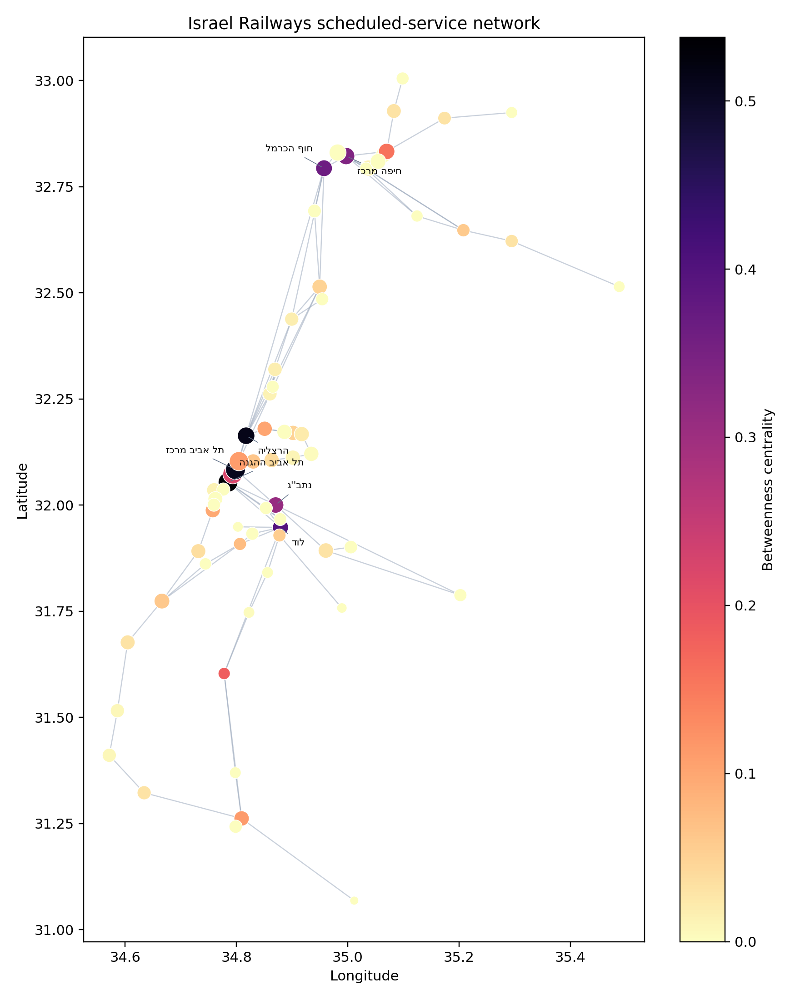
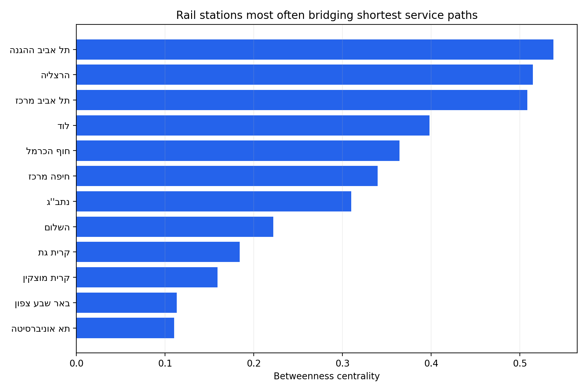
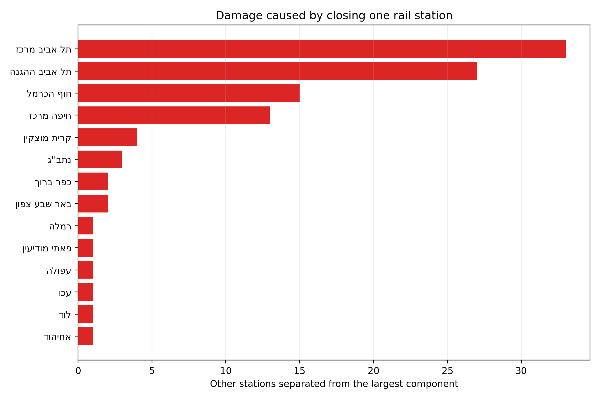
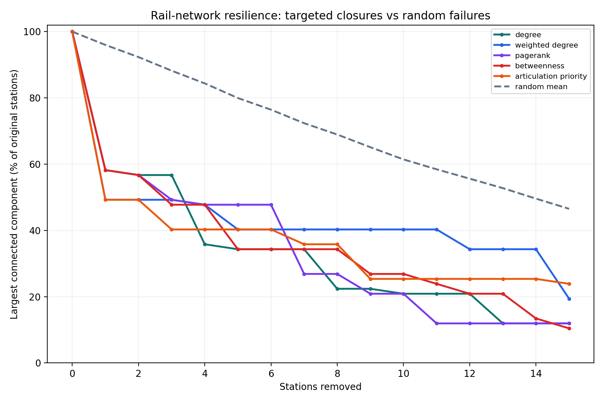
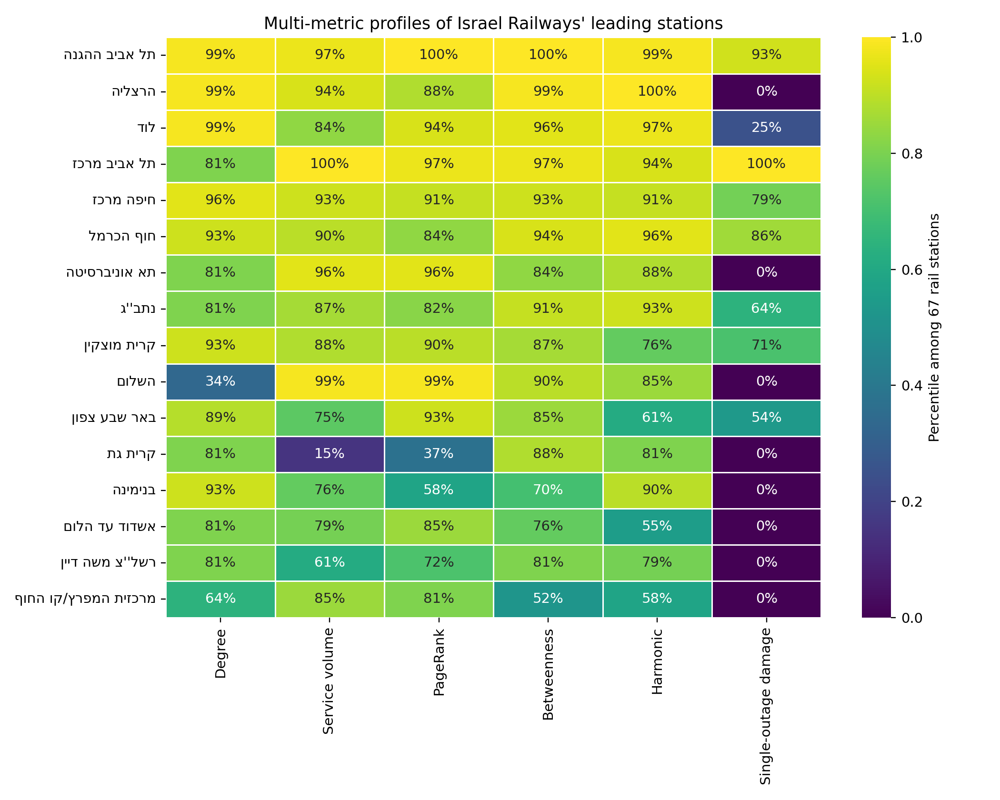
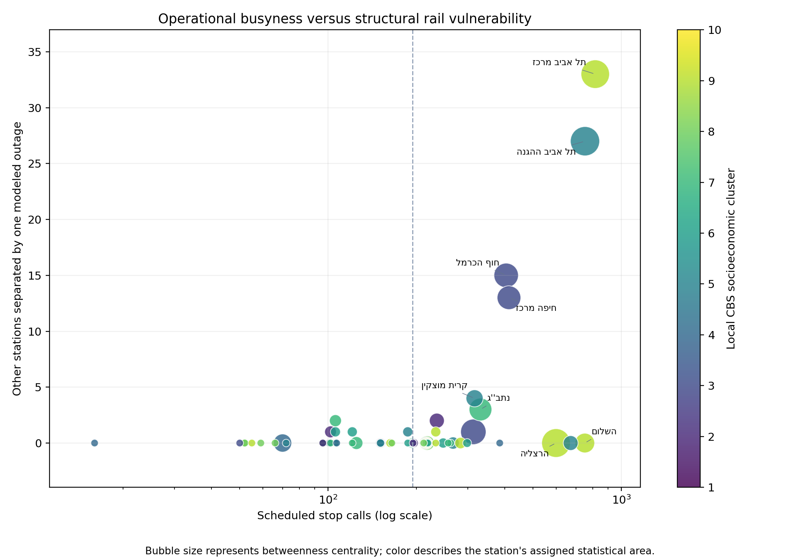
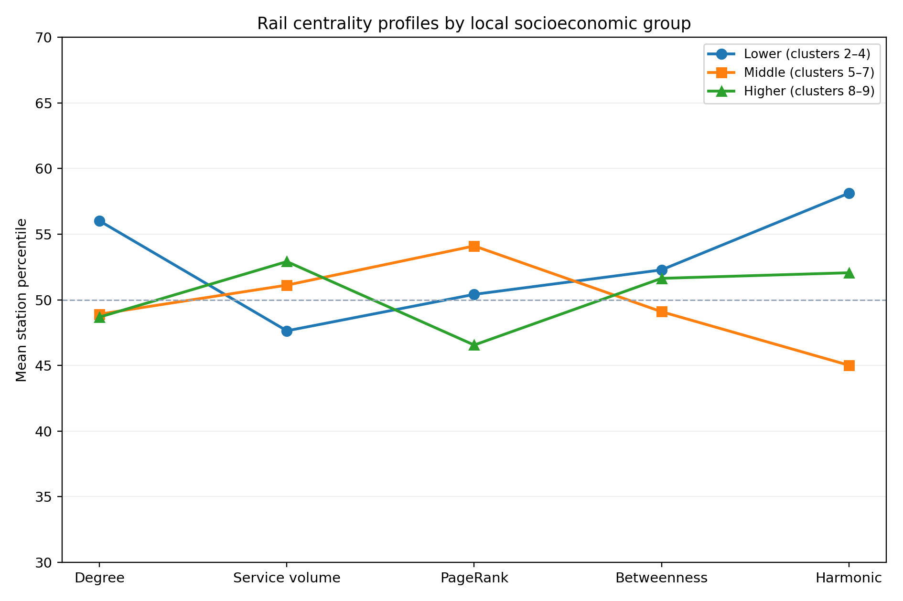
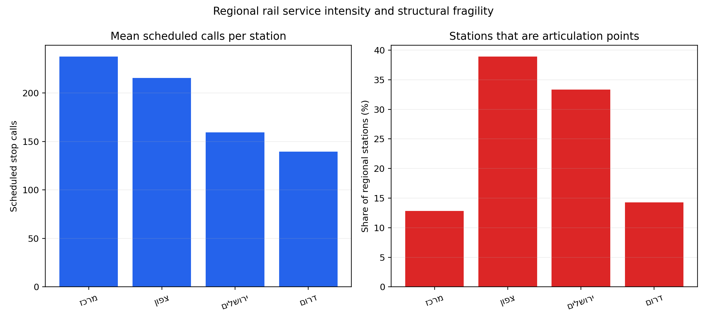
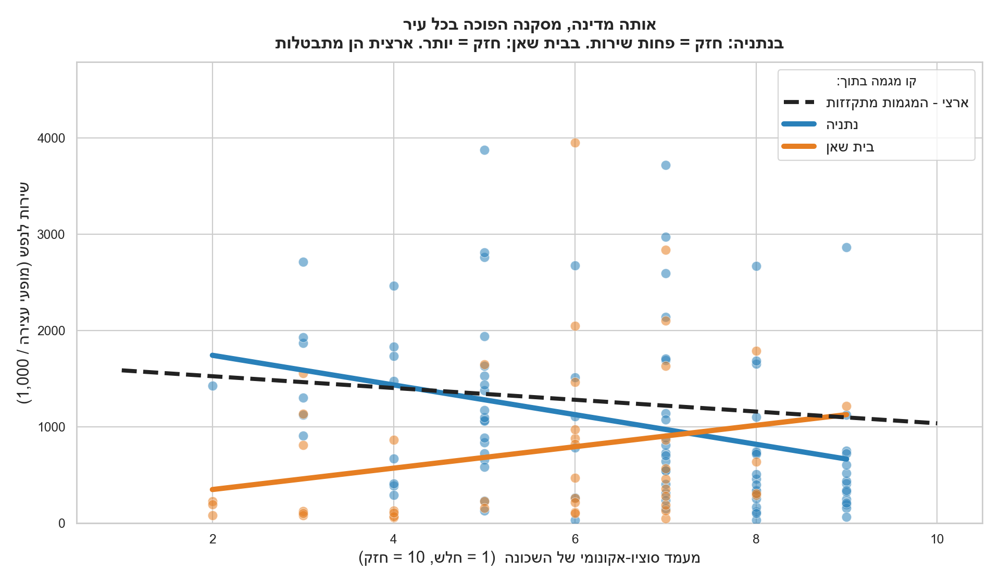
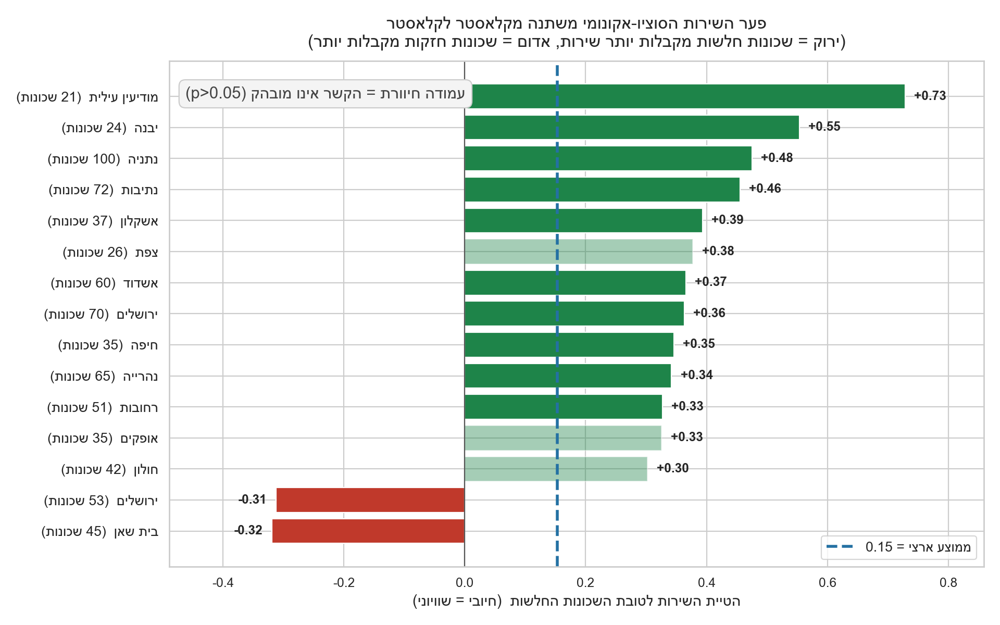

# Israel Railways Network Resilience

Analysis date: 10 July 2026  
GTFS scheduled-service window: 19 April–19 May 2026

## Executive summary

The repository's GTFS feed is overwhelmingly bus-oriented, but it is not
bus-only. It contains a complete-looking Israel Railways subset identified by
GTFS `route_type=2` and agency `רכבת ישראל`. This subset was isolated and
analyzed with the same trip-adjacency graph definition used by the main project.

The rail service graph contains 67 active stations and is fully connected in the
undisturbed snapshot. It is nevertheless highly dependent on a small number of
corridor stations. Fourteen stations are articulation points and 11 service
connections are bridges. A modeled outage at Tel Aviv Center/Savidor divides the
remaining network into two equal components of 33 stations. An outage at Tel
Aviv HaHagana leaves 39 stations in the largest component and separates 27.

This is a stronger targeted-failure effect than in the national public-transport
graph. A random single-station failure leaves 96.2% of the original rail stations
connected on average. Targeting Tel Aviv Center/Savidor leaves only 49.3%, while
targeting the highest-betweenness station, Tel Aviv HaHagana, leaves 58.2%.

## Data audit and scope

The local feed contains the following scheduled trip records:

| GTFS mode | Route records | Scheduled trips | Share of trips |
|---|---:|---:|---:|
| Bus (`route_type=3`) | 6,796 | 412,544 | 98.19% |
| Israel Railways (`route_type=2`) | 962 | 1,188 | 0.28% |
| Tram/light rail (`route_type=0`) | 8 | 2,890 | 0.69% |
| Other coded modes | 26 | 3,511 | 0.84% |

The 962 rail route records should not be interpreted as 962 physical railway
lines. They represent schedule and service variants; there are 82 distinct
`route_long_name` descriptions in this snapshot.

The source is the Israeli Ministry of Transport's static GTFS publication:

- [Ministry GTFS information page](https://www.gov.il/he/pages/gtfs_general_transit_feed_specifications)
- [Official GTFS download directory](https://gtfs.mot.gov.il/gtfsfiles/)
- [GTFS route-type definition](https://gtfs.org/documentation/schedule/reference/#routestxt)

The official directory contained a newer national archive dated 9 July 2026 at
the time of this analysis. The repository's hydrated local snapshot was retained
to keep the rail analysis directly comparable with the project's existing bus
analysis. Consequently, the results describe scheduled service from 19 April to
19 May 2026, not current real-time operations.

This report covers Israel Railways heavy rail only. Urban light rail is coded
separately as `route_type=0` and is not mixed into the national rail graph.

## Graph definition and research question

The main question is the same as in the national project:

> How resilient is Israel's scheduled rail network to disruptions at central
> stations and service links, and which stations create the greatest structural
> damage when removed?

The graph is defined as follows:

- A node is an active Israel Railways station.
- A directed edge connects consecutive stops in a scheduled train trip.
- Edge weight is the number of scheduled train trips using that connection.
- The undirected projection is used for connectivity, articulation, bridge,
  community, shortest-path, and resilience calculations.

Because the graph follows scheduled stopping patterns, an express train can
create a direct service edge between stations while skipping intermediate
stations. This is a service network rather than a map of physical tracks.

## Structural results

| Measure | Result |
|---|---:|
| Active stations | 67 |
| Directed service edges | 197 |
| Undirected service edges | 99 |
| Connected components | 1 |
| Average degree | 2.96 |
| Density | 0.0448 |
| Average clustering | 0.365 |
| Average shortest path | 5.63 station hops |
| Diameter | 13 station hops |
| Articulation points | 14 |
| Bridge connections | 11 |
| Louvain communities | 8 |



The intact network is connected, but full connectivity hides substantial
single-node dependence. Approximately 21% of all stations are articulation
points. Several terminal branches have only one structural access connection,
including the Nahariya, Karmiel, Beit She'an, Modi'in Center, Beit Shemesh,
Rishonim, and Dimona branches in this service snapshot.

## Critical stations

### Highest betweenness centrality

| Rank | Station | Betweenness | Degree | Scheduled stop calls |
|---:|---|---:|---:|---:|
| 1 | Tel Aviv HaHagana | 0.538 | 8 | 752 |
| 2 | Herzliya | 0.515 | 8 | 599 |
| 3 | Tel Aviv Center/Savidor | 0.509 | 4 | 815 |
| 4 | Lod | 0.398 | 8 | 313 |
| 5 | Haifa Hof HaCarmel | 0.364 | 6 | 405 |
| 6 | Haifa Center | 0.340 | 7 | 414 |
| 7 | Ben Gurion Airport | 0.310 | 4 | 331 |



Betweenness and service volume are related but not identical. Tel Aviv
Center/Savidor has the highest weighted degree, followed by HaShalom, HaHagana,
and Tel Aviv University. Herzliya ranks second in betweenness despite being only
fifth in weighted degree. Structural importance therefore cannot be inferred
from schedule frequency alone.

### Damage from one modeled station outage

| Removed station | Largest remaining component | Other stations separated from it | Components after removal |
|---|---:|---:|---:|
| Tel Aviv Center/Savidor | 33 of 66 | 33 | 2 |
| Tel Aviv HaHagana | 39 of 66 | 27 | 2 |
| Haifa Hof HaCarmel | 51 of 66 | 15 | 2 |
| Haifa Center | 53 of 66 | 13 | 3 |
| Kiryat Motzkin | 62 of 66 | 4 | 3 |
| Ben Gurion Airport | 63 of 66 | 3 | 2 |

The Savidor split separates the northern service network—including Tel Aviv
University, Herzliya, the Sharon, Haifa, the Jezreel Valley, Akko, Nahariya, and
Karmiel—from the southern and Jerusalem side of the graph. HaHagana produces the
complementary southern bottleneck: its removal separates 27 stations across the
southern coastal, Negev, Lod/Ramla, Beit Shemesh, and Rishon branches.



## Targeted disruption versus random failure

The resilience experiment uses fixed rankings from the intact graph and compares
them with the mean of 500 random removal orders. The measured outcome is the size
of the largest connected component as a percentage of the original 67 stations.

| Stations removed | Random mean | Best targeted damage at that step |
|---:|---:|---:|
| 1 | 96.2% | 49.3% — weighted degree/articulation priority |
| 3 | 88.6% | 40.3% — articulation priority |
| 5 | 81.0% | 34.3% — degree/betweenness |
| 10 | 62.4% | 20.9% — degree/PageRank |
| 15 | 47.5% | 10.4% — betweenness |



The sharp gap between targeted and random removal is the central result. The
rail service graph has little random-failure exposure at one node, but a small
set of correctly chosen outages fragments it quickly. At three targeted
articulation-priority removals, only 27 stations—40.3% of the original
network—remain together, compared with 59.3 stations on average under random
removal.

## What all the centrality measures reveal

No single centrality measure is a sufficient definition of a critical station:

- **Degree** measures the diversity of directly adjacent scheduled stops.
- **Weighted degree and scheduled stop calls** measure service intensity.
- **PageRank** emphasizes stations connected through frequent, important flows.
- **Betweenness** finds stations that broker many shortest service paths.
- **Harmonic centrality** measures how close a station is to the whole network,
  while remaining valid if the network fragments.
- **Single-outage damage** measures realized fragmentation rather than inferred
  importance.

The strongest station-level Spearman relationships are:

| Measures compared | Spearman rho | Interpretation |
|---|---:|---|
| Weighted degree vs scheduled stop calls | 0.943 | Both mostly measure service volume. |
| Weighted degree vs PageRank | 0.859 | Frequent corridors strongly shape directed importance. |
| Degree vs harmonic centrality | 0.823 | Locally well-branched stations tend to be globally accessible. |
| PageRank vs betweenness | 0.752 | Flow importance and brokerage overlap, but are not identical. |
| Betweenness vs single-outage damage | 0.568 | Betweenness helps predict damage, but alternatives matter. |
| Stop calls vs single-outage damage | 0.339 | Busyness alone is a weak indicator of fragmentation. |



The composite profile places Tel Aviv HaHagana first, followed by Herzliya,
Lod, Tel Aviv Center/Savidor, Haifa Center, and Haifa Hof HaCarmel. The more
interesting result is not the ordering but the different station archetypes:

- **Critical high-service hubs:** HaHagana, Savidor, Lod, Haifa Center, Hof
  HaCarmel, Ben Gurion Airport, and Kiryat Motzkin combine high service/network
  importance with structural fragmentation risk.
- **Busy but structurally redundant hubs:** Herzliya, HaShalom, Tel Aviv
  University, and several other service-intensive stations do not fragment the
  graph when removed individually.
- **Structural branch gateways:** stations such as Patei Modi'in, Kfar Baruch,
  and Ramla are not the busiest national hubs but control access to smaller
  branches.
- **Structural brokers with alternatives:** a station can have high betweenness
  while still being bypassable. Herzliya is the strongest example: it ranks
  second in betweenness and first in harmonic centrality, but its individual
  removal causes no fragmentation.

HaShalom provides the inverse warning about frequency metrics. It is at the
99th percentile for service volume and PageRank, but only the 34th percentile
for degree and causes no topological fragmentation. Its closure would be a major
operational problem, but it is not a national connectivity cut in this graph.



## Socioeconomic and regional findings

Rail stations were joined to the repository's existing [CBS 2021 socioeconomic
statistical-area layer](https://www.cbs.gov.il/he/subjects/Pages/מדד-חברתי-כלכלי-של-הרשויות-המקומיות.aspx).
All 67 stations have an assignment: 44 lie inside a CBS polygon and 23 use the
nearest polygon within the original analysis's three-kilometre limit.

There is **no statistically meaningful monotonic relationship** between the
assigned local socioeconomic cluster and any rail centrality measure:

| Rail measure vs socioeconomic cluster | All 67 stations rho | Within-polygon 44 rho |
|---|---:|---:|
| Degree | -0.127 | -0.219 |
| Weighted degree | 0.075 | 0.048 |
| PageRank | -0.054 | -0.079 |
| Betweenness | -0.024 | -0.001 |
| Harmonic centrality | -0.089 | -0.137 |
| Single-outage damage | -0.179 | -0.267 |

Every two-sided p-value is above 0.05. Replacing the ordinal cluster with the
continuous CBS index produces the same conclusion. This is a useful negative
finding: the national rail topology does not follow a simple richer-area versus
poorer-area centrality gradient.

Grouped descriptive results still show nuances:

| Local socioeconomic group | Stations | Mean stop calls | Median weighted degree | Articulation share |
|---|---:|---:|---:|---:|
| Lower, clusters 2–4 | 18 | 188.8 | 301 | 27.8% |
| Middle, clusters 5–7 | 28 | 216.6 | 302 | 25.0% |
| Higher, clusters 8–9 | 21 | 244.6 | 424 | 9.5% |

Stations assigned to higher-cluster areas have somewhat more scheduled service
on average and are less often articulation points. This should not be read as a
resident-level equity result: a major station's immediate statistical area does
not describe its regional passenger catchment, 23 assignments use a nearest
polygon, and the socioeconomic layer is from 2021 while the GTFS is from 2026.



The regional comparison is sharper than the socioeconomic comparison. Central
stations average 237.5 scheduled calls, compared with 215.6 in the north, 159.3
around Jerusalem, and 139.7 in the south. Meanwhile, 38.9% of northern stations
are articulation points, versus 12.8% in the center. This suggests that the
north has substantial service but less structural redundancy. Jerusalem and the
south have small samples and should not be ranked confidently from these shares
alone.



### A broader all-mode insight: the national average hides local inequality

The repository's bus-dominated, all-mode socioeconomic analysis contains a
Simpson's-paradox pattern that is more informative than the pooled national
correlation. Across 2,680 CBS neighborhoods, socioeconomic rank has a weak
negative association with scheduled service per resident (`rho=-0.153`): lower
ranked areas tend to have somewhat more scheduled service per capita. Stop
density itself is essentially unrelated to socioeconomic rank (`rho=0.025`).

Once neighborhoods are compared inside their Louvain network communities, the
relationship varies dramatically. Across 57 sufficiently varied communities,
the service-per-capita correlation ranges from `-0.729` to `+0.319`; 15 are
nominally significant at `p<0.05`. Examples include:

- Modi'in Illit (`rho=-0.729`), Beitar Illit (`-0.705`), Yavne (`-0.554`),
  Netanya (`-0.475`), and Netivot (`-0.455`): weaker neighborhoods receive more
  scheduled service per resident inside the local network community.
- Beit She'an (`rho=+0.319`), one Jerusalem community (`+0.312`), and Kiryat
  Shmona (`+0.210`): the direction reverses, with stronger neighborhoods
  receiving more service per resident.





This means “is public transport distributed equitably?” has no honest single
national yes/no answer. Local urban form, density, community boundaries, and
service patterns dominate. These are exploratory multiple comparisons and the
15 nominally significant results were not adjusted for false discovery, so the
named communities are hypotheses for follow-up rather than final causal claims.

## Conclusions

1. **The scheduled rail network is connected but corridor-dependent.** Its
   national reach relies on a small number of central nodes rather than many
   redundant alternatives.
2. **The Tel Aviv Ayalon corridor is the dominant national vulnerability.** Tel
   Aviv Center/Savidor and HaHagana form the clearest north/south cut points in
   the service graph.
3. **Haifa is a second regional bottleneck.** Hof HaCarmel and Haifa Center
   control access to northern coastal and Jezreel Valley services.
4. **Busy is not the same as critical.** Frequency-weighted importance favors
   the Tel Aviv stations, while betweenness also exposes Herzliya, Lod, and
   Haifa as structural connectors.
5. **Peripheral branches have limited redundancy.** Eleven bridge connections
   mean that several branches can be separated through one connection failure.
6. **Targeted failures are much more damaging than random failures.** This
   supports prioritizing contingency planning, replacement service, and
   operational redundancy around the identified articulation corridors.

## Recommended next project: disruption-equity accessibility

The highest-value next analysis is:

> **Who loses access to jobs, hospitals, and education when a critical rail
> corridor fails, and does the travel-time penalty differ by socioeconomic
> group?**

This would turn the current static topology into a time-dependent multimodal
accessibility model:

1. Build a morning-peak graph from actual GTFS departure and arrival times.
2. Add walking transfers between nearby bus, light-rail, and heavy-rail stops.
3. Use CBS statistical-area populations as origins and major employment,
   hospital, and education locations as destinations.
4. Calculate destinations reachable within 30, 45, and 60 minutes.
5. Simulate Savidor, HaHagana, Hof HaCarmel, and northern-branch disruptions.
6. Compare lost accessibility and added travel time across socioeconomic groups.
7. Test replacement-bus links and rank which contingency connection restores
   the most access per vehicle-hour.

This is more policy-relevant than another centrality score because it measures
human consequences, distinguishes a station closure from a corridor outage, and
can directly recommend where replacement service should be staged.

## Interpretation limits

- A removed node means that no modeled trip can use that station node. This is
  closer to a station-and-corridor service outage than a simple closure where
  trains continue through without stopping. Results may therefore overstate the
  effect of a platform-only closure.
- GTFS contains planned schedules, not observed operations or passenger demand.
- Edge weights count scheduled service segments; they do not represent passenger
  volumes, track capacity, delay propagation, or infrastructure condition.
- Express stopping patterns create service edges that are not individual track
  segments. Physical infrastructure resilience requires track topology, switch,
  junction, signaling, and depot data.
- The analysis uses one service snapshot. Seasonal schedules, emergency
  timetables, and construction closures can change rankings.

## Reproduction

Install the project requirements, hydrate the GTFS files through Git LFS, then
run:

```powershell
python src\rail_network_analysis.py `
  --data-dir israel-public-transportation `
  --output-dir outputs\rail

python src\rail_socioeconomic_analysis.py
```

The command streams the national `stop_times.txt`, retains only Israel Railways
trips, computes exact centralities, evaluates every single-station removal, runs
500 random baselines, and writes all tables and figures under `outputs/rail/`.
